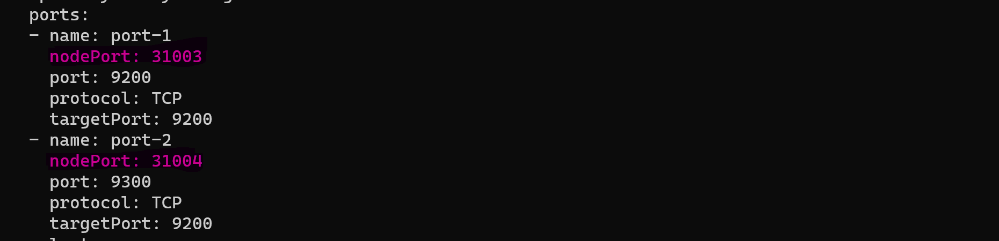

## **Elasticsearch installation on WSL**

    $ helm repo add elastic https://helm.elastic.co
    $ helm search repo elastic
    $ helm show values elastic/elasticsearch > es.yml
    $  helm install elastic elastic/elasticsearch --set imageTag=7.17.3 -f es.yml -n dop
    $  kubectl get secrets --namespace=dop elasticsearch-master-credentials -ojsonpath='{.data.password}' | base64 -d

    $ kubectl expose svc/elasticsearch-master --type=NodePort --name=cusessvc --target-port=9200 -n dop
    $ kubectl edit svc/cusessvc -o yaml

