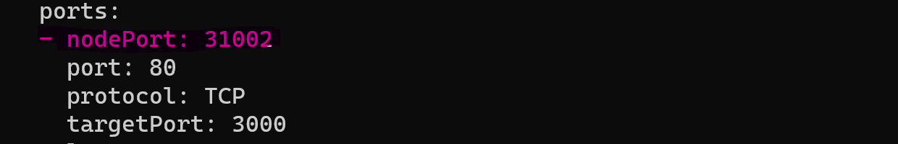

## **Grafana Installation in WSL:**

    $ helm repo add grafana https://grafana.github.io/helm-charts

    $ helm search repo grafana

    $ helm show values grafana/grafana > grafvalues.yml

    $  helm install grafana grafana/grafana -f grafvalues.yml -n dop

**NodePort:** 

    $ kubectl expose svc/grafana --type=NodePort --name=cusgrafsvc --target-port=3000 -n dop

    $ kubectl edit svc/cusgrafsvc -o yaml

    decode the secret value of garfana for login

    $  kubectl get secret --namespace dop grafana -o jsonpath="{.data.admin-password}" | base64 --decode ; echo