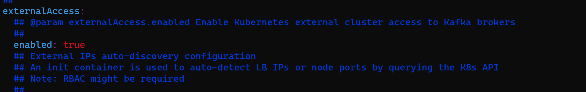
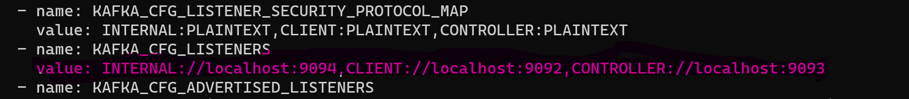

    $ helm show values bitnami/kafka > kafka.yaml

    (or)

    $ helm install kafka bitnami/kafka -f kafka.yaml -set externalAccess.enabled=true -n dop

    $ helm show values bitnami/zookeeper > zookeeper.yaml
    
    $ helm install zookeeper bitnami/zookeeper -f zookeeper.yaml -n dop

    $ kubectl expose svc/kafka --type=NodePort --name=cuskfksvc --target-port=9092 -n dop

    $ kubectl expose svc/zookeeper --type=NodePort --name=cuszoosvc --target-port=2181 -n dop

    $kubectl expose svc/kafka --type=NodePort --name=cuskfksvc --target-port=9092 -n dop

* updated node port

        $ kubectl edit svc/cuskfksvc -n dop
        $ kubectl edit svc/cuszoosvc -n dop

* update the kafka statefulsets.

        $ kubectl edit sts kafka -n dop

