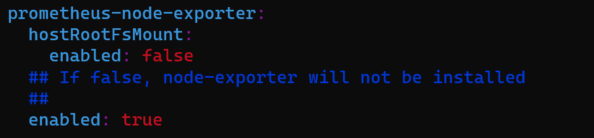
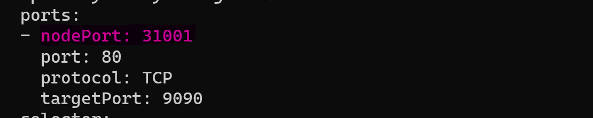
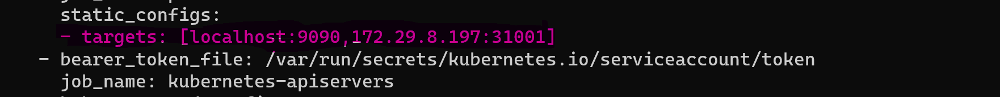

## **Installing Prometheus sing Helm on WLS**

    $ helm repo add prometheus-community https://prometheus-community.github.io/helm-charts

    $  helm search repo prometheus-community
    

    
    $ kubectl create ns dop
    
       create promvalues.yml file to update configuration below cmd.

    $ helm show values prometheus-community/prometheus > promvalues.yml

    $ helm install prometheus prometheus-community/prometheus -f prometheus/promvalues.yml -n dop

**NodePort:** 

    $ kubectl expose svc/prometheus-server --type=NodePort --name=cuspromserver --target-port=9090 -n dop

    $ kubectl expose svc/prometheus-server --type=NodePort --name=cuspromserver --target-port=9090 -n dop

    $  kubectl edit svc/cuspromserver -n dop -o yaml
    
* update the nodeport value to 31001

    $ kubectl get cm 

    $  kubectl edit cm prometheus-server -o yaml

* Update the target value using nodeport and ip

